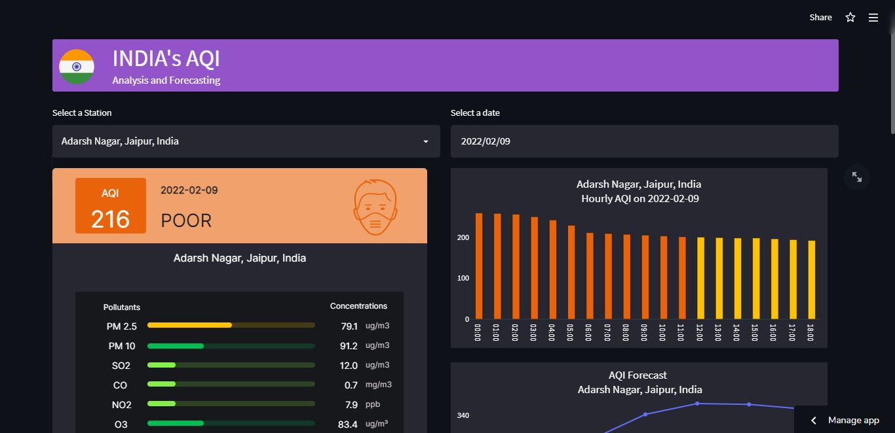

# Build with

# AQI(Air Quality Index) Analysis ,Visualization and Forecasting.

A web App deployed on HEROKU CLOUD/Strealit CLoud ,that Analyse & visualize the Air Quality Data collected on hourly basis from 153 stations in india and than Forecast the AQI(Air Quality Index) for next 7 days, for every individual station.

https://user-images.githubusercontent.com/72800256/163836662-ac229c24-bf3c-414f-837a-fb104be99958.mp4

You can try out this app [here.](https://share.streamlit.io/hitman-dev/indias-aqi/app.py)

### What is AQI & how is it calculated ?

AQI is defined as an overall scheme that transforms weighted values of individual air pollution
related parameters (SO2, CO, visibility, etc.) into a single number or set of numbers. The Air Quality
Index criteria is defined by the Central Pollution Control Board of India (CPCB), Delhi. CPCB air
quality standards necessitate for 12 parameters – PM 10, PM 2.5, NO2, SO2, CO, O3, NH3, Pb, Ni,
As, Benzo(a) pyrene, and Benzene. However, the selection of parameters primarily depends on AQI
objective(s),data availability, averaging period, monitoring frequency, and measurement methods.
While PM 10, PM 2.5, NO2, SO2, NH3 and Pb have 24-hourly as well annual average standards,
Ni, As, benzo(a)pyrene, and benzene have only annual standards and CO and O 3 have short-term
standards (01 and 08 hourly average). PM 10, PM 2.5, SO2, NO2, CO, and O 3 are measured on a
continuous basis at many air quality stations (including NH 3 at some stations), Pb, Ni, As,
Benzo(a)pyrene and NH 3, if monitored, use manual systems. To get an updated AQI at short time
intervals, ideally eight parameters (PM 10, PM 2.5, NO2, SO2, CO, O3, NH3, and Pb) for which,
short-term standards are prescribed should, be measured on a continuous basis.

