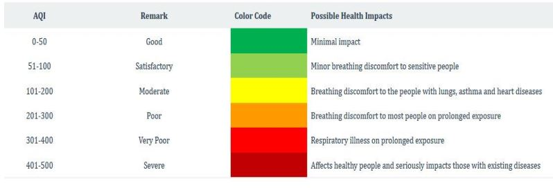
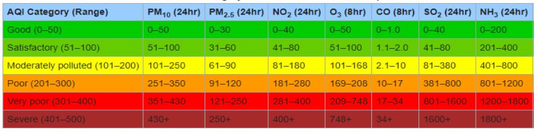
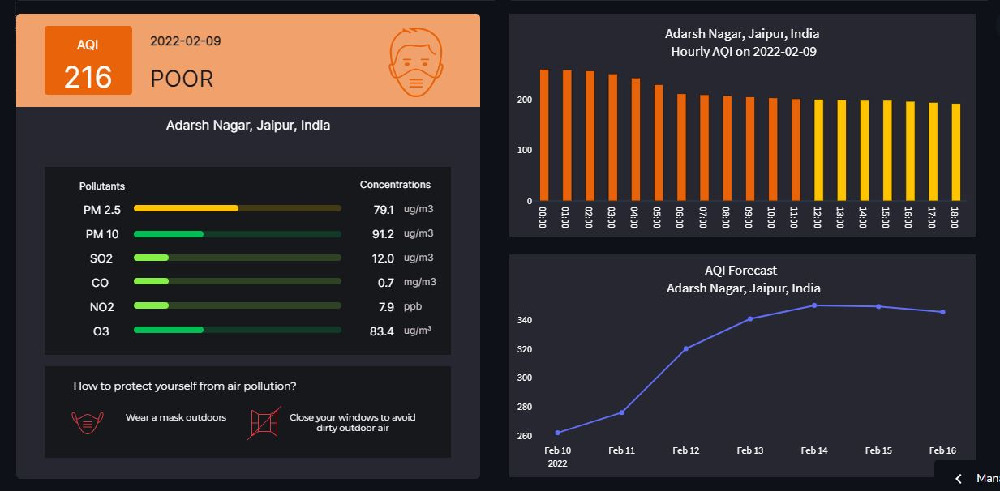
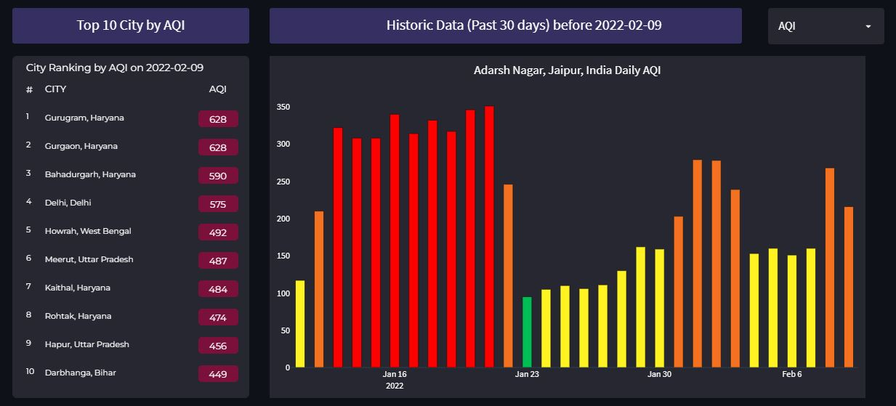
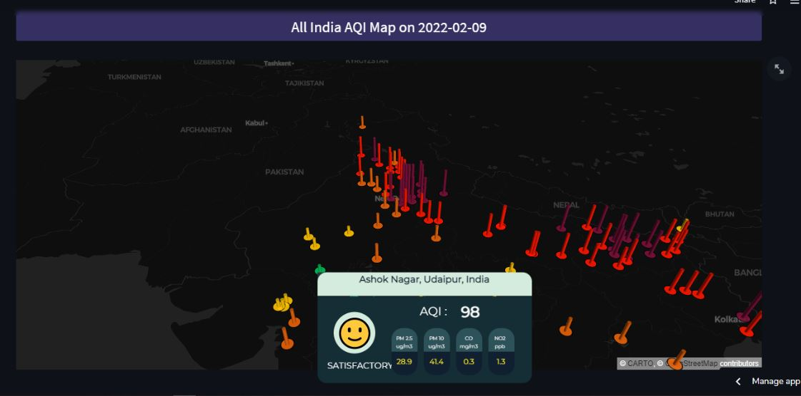

# Build with
[](https://www.python.org/downloads/release/python-380/)


[](https://www.linkedin.com/posts/hitesh-chaudhari-0259ba14a_data-india-cloud-activity-6921765376657641472-2Zyd?utm_source=linkedin_share&utm_medium=member_desktop_web)

# AQI(Air Quality Index) Analysis ,Visualization and Forecasting.

A web App deployed on HEROKU CLOUD/Strealit CLoud ,that Analyse & visualize the Air Quality Data collected on hourly basis from 153 stations in india and than Forecast the AQI(Air Quality Index) for next 7 days, for every individual station.

Watch a short App flow video here 👇.

https://user-images.githubusercontent.com/72800256/163836662-ac229c24-bf3c-414f-837a-fb104be99958.mp4

You can try out this app [here.](https://share.streamlit.io/hitman-dev/indias-aqi/app.py)

## What is AQI & how is it calculated ?

AQI is defined as an overall scheme that transforms weighted values of individual air pollution
related parameters (SO2, CO, visibility, etc.) into a single number or set of numbers. The Air Quality
Index criteria is defined by the Central Pollution Control Board of India (CPCB), Delhi. CPCB air
quality standards necessitate for 12 parameters – PM 10, PM 2.5, NO2, SO2, CO, O3, NH3, Pb, Ni,
As, Benzo(a) pyrene, and Benzene. However, the selection of parameters primarily depends on AQI
objective(s),data availability, averaging period, monitoring frequency, and measurement methods.
While PM 10, PM 2.5, NO2, SO2, NH3 and Pb have 24-hourly as well annual average standards,
Ni, As, benzo(a)pyrene, and benzene have only annual standards and CO and O 3 have short-term
standards (01 and 08 hourly average). PM 10, PM 2.5, SO2, NO2, CO, and O 3 are measured on a
continuous basis at many air quality stations (including NH 3 at some stations), Pb, Ni, As,
Benzo(a)pyrene and NH 3, if monitored, use manual systems. To get an updated AQI at short time
intervals, ideally eight parameters (PM 10, PM 2.5, NO2, SO2, CO, O3, NH3, and Pb) for which,
short-term standards are prescribed should, be measured on a continuous basis.

## Project overview
In this project we have collected data from various sources like kaggle and API such as WAQI and OPENWEATHERMAP, performed EDA on the data and stored it on GitHub, then apply Forecasting model.

## API Used

Below are the links of API's used to collect AQI related information

- WAQI Api to collect location co-ordinates of the AQI monitoring stations in India.
  - Get Active stations [notebook.](https://github.com/hitman-dev/Indias-AQI/blob/master/notebooks/get_active_stations.ipynb)
  - API link :- 'https://aqicn.org/data-platform/token/'

- OpenWeathermap API to get concentration of the particulates from the 153 AQI monitoring stations in India based on the location co-ordinates gathered from WAQI API.
  - Get concentration of particulates from active stations [notebook.](https://github.com/hitman-dev/Indias-AQI/blob/master/notebooks/2020-2022_dataCollection.ipynb) 
  - API link :- 'https://openweathermap.org/api/air-pollution'
 
## Calculating AQI 

AQI is calculated with the help of [Guidelines](https://app.cpcbccr.com/ccr_docs/How_AQI_Calculated.pdf) given by [CPCB](https://cpcb.nic.in/index.php)(Central Pollution Contrl Board)
AQI bucketing is used to understand the air quality for a region which is based on the values of AQI. The range of AQI, colors assigned and its corresponding effects are assigned as per the CPCB guidelines and are as follows.



The range of 24hr average of concentration of a individua particulate, colors assigned and its corresponding effects are also specified as per the CPCB guidelines and are as follows.



The Exploratory Data Analysis(EDA) and calculation of the AQI as specified by the above mention guidelines are shown i this [notebook.](https://github.com/hitman-dev/Indias-AQI/blob/master/notebooks/2020-2022_history_data_processed.ipynb)

## AQI Forecasting

For forecasting we have used various algorithms and auto ML libraries but the best out was given by Pycaret auto ML library.
PyCaret is an Auto-ML library used for the building machine learning models. PyCaret is an open-source, low-code machine learning library in Python that automates machine learning workflows.It is an end-to-end machine learning and model management tool that exponentially speeds up the
experiment cycle and makes you more productive.
You can get more information about PyCaret[here.](https://pycaret.org/)
So by using PyCaret Forecasting Algorithm, we made individual models for each station(total 153 ML models) which are loaded dynamically and gives the respective station forecasting for next 7 days.

Code for Forecasting model
```python
from pycaret.regression import *

all_ts = data['City'].unique()
all_results = []
final_model = {}

for i in all_ts:
    df_subset = data[data['City'] == i]
    # initialize setup from pycaret.regression
    s = setup(df_subset, target = 'AQI', train_size = 0.95, transform_target = True, remove_outliers = True, data_split_shuffle = False,
              fold_strategy = 'timeseries', fold = 5, ignore_features = ['City'], numeric_features = ['day_of_year', 'year'],
              categorical_features = ['month', 'day_of_week'], silent = True, verbose = False, session_id = 2022)
    # compare all models and select best one based on MAE
    best_model = compare_models(sort = 'MAE', verbose=True)
    
    # capture the compare result grid and store best model in list
    p = pull().iloc[0:1]
    p['City'] = str(i)
    all_results.append(p)
    
    # finalize model i.e. fit on entire data including test set
    f = finalize_model(best_model)
    
    # attach final model to a dictionary
    final_model[i] = f
    
    # save transformation pipeline and model as pickle file 
    save_model(f, model_name='trained_models/' + str(i), verbose=False
```
The Data Processing for Forecasting modeling and saving the individual station model is shown in this [notebook.](https://github.com/hitman-dev/Indias-AQI/blob/master/notebooks/PyCaret_timeseries_forecasting.ipynb)

The models are than loaded dynamically for forecasting of AQI for each individual station.

# Flow of Application
### Selection of Input
The app assists in selection of input Staion and Date for which you wnat to see the AQI Analysis ,Visualization and Forecasting.


### AQI related information and Forecasting
 The app shows a info card that shows AQI, Air Quality, Particulate concentrations, and syggestions according to the Air quality. It also shows the Daily hourly analysis of AQI and Forecasting for the next seven days.


### Top 10 Cities by AQI and Past 30 Days Analysis
 The app shows a info card that shows top 10 cities Acoording to the AQI on a particular seleted date. It also shows the past 30 days analysis of AQI and other particultes such as PM2.5, PM10, NO2, SO2, CO, O3.


### All over India AQI
We have also shown an interactive Map of India which shows data of all 153 stations . 


 # Collaboration 
 This project is collaborative work of:-
 
#### Hitesh Chaudhari
[](https://www.linkedin.com/in/hitesh-chaudhari-0259ba14a/)
[](https://github.com/hitman-dev)
 
#### Siddhant Mishra
[](https://www.linkedin.com/in/siddhant-mishra-02aa50110/)
[](https://github.com/0NE-C0DEMAN)


